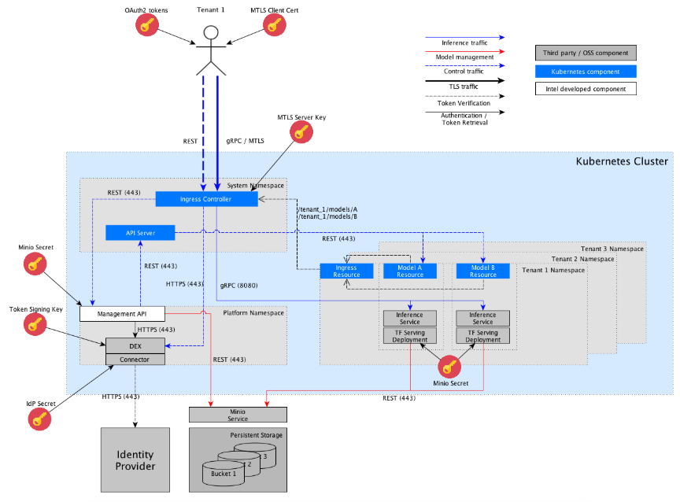

# Architecture overview

Inference Model Manager exposes 2 types of interfaces: 
- Management REST API with token based authentication & authorization
- gRPC inference endpoints with MTLS client authentication and TensorFlow Serving API

Each of the models deployed on the platform is represented by an Inference Endpoint CRD and hosted as 
a TensorFlow Serving 'service' and 'deployment' instance within a K8S cluster. 
The gRPC API exposed by the TensorFlow Serving instance will be accessible externally on a predefined URL 
(see [Create Endpoint](../management/README.md#create-endpoint)).
The TensorFlow Serving instance during its initialization loads the model from the configured Storage Bucket.

Inference endpoints are grouped by tenants which represents a team or organization. 
All inference endpoints created for a tenant are hosted in the same K8S namespace that also groups other resources 
pertaining to that tenant.

Inference Model Manager integrates with 3rd party components:
- Minio/S3 for model storage
- Identity Provider which could be LDAP (current version), KeyStone from OpenStack, GitHub or other provider supported by DEX

REST management API exposed by platform uses the same token and RBAC rules for authentication and authorization 
as used by K8S API. 
REST API is used for convenience and management simplification. A complete platform state is stored in kubernetes itself.

Minio server with S3 is used for storage of the models. All user interaction with Minio are implemented via management API only. 
It means that users do not need to connect to the Minio directly and they don't need its credentials.

Management API acts as a proxy for filtering the traffic to Minio based on token validity and user permissions. 

Inference requests targeted to the Inference Endpoint instances hosted within the platform are authenticated via MTLS.
Each Inference Endpoint expects clients to use specific X509 Client Certificate issued by a CA configured on per Tenant basis.

The K8S cluster Ingress Controller is responsible for terminating the TLS traffic and client certificate verification
 (based on allowed certificate Subject Name).

All calls to the Management API are authenticated based on JWT token with limited life-time. 
The tokens are issued based on user credentials verified by an external Identity Provider (LDAP, Keystone, Github etc).
They are self-contained to enable fully offline authentication and authorization that does not require additional 
in-band calls to the Identity Provider. Authentication is based on token signature and expiry time, 
while authorization decisions is based on group information (received from the external IdP) embedded within the token 
that maps to kubernetes permissions in the Tenant specific namespace. Token authorization is delegated to K8S,
which require enabling OID integration on kube-apiserver.  

In the platform we can distinguish the following roles:

| Role | Description | Permissions |
| ------------- |:-------------:| -----|
| Cluster administrator | a person with administrative permissions in K8S cluster | Full administrative access to the k8s cluster and the nodes |
| Platform administrator | a person able to create and delete new tenants via platform API | permissions to add and delete tenants |
| Tenant user | a person managing inference endpoints and AI models in the scope of a tenant | access to management API and ability to manage the inference endpoints and models in the scope of a tenant|
| Client | application or user executing inference requests over gRPC interface |executing inference requests over established endpoints|

